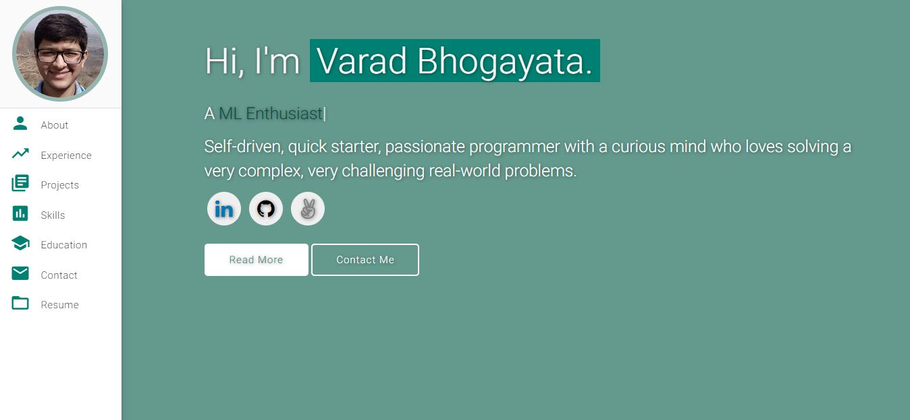

# Personal Portfolio - Parag Gupta ⚡️ 
> A clean, responsive portfolio showcasing my experience as a DevOps Engineer and Cloud Architect

> https://paraggupta10.github.io

 

### Website Preview

 
  <kbd>
    
  </kbd>

## Features 📋
⚡️ Fully Responsive Design\
⚡️ Modern UI with Material Design\
⚡️ Dynamic Typing Animation\
⚡️ Easy to Customize and Update

## Sections 📚
✔️ About Me - Professional Summary\
✔️ Experience - Work History\
✔️ Projects - DevOps and Cloud Projects\
✔️ Skills - Technical Expertise\
✔️ Publications - Technical Blogs\
✔️ Education - Academic Background\
✔️ Contact - Get in Touch\
✔️ Resume - Downloadable PDF

## Technologies Used 🛠️
* [<b>GitHub Pages</b>](https://pages.github.com/) - For hosting the static website
* [<b>Materialize CSS</b>](https://materializecss.com/) - Material Design framework
* [<b>jQuery</b>](https://jquery.com/) - JavaScript library
* [<b>Typed.js</b>](https://mattboldt.com/demos/typed-js/) - For the typing animation effect

## Development and Deployment 📦
- Clone the repository and modify the content of <b>index.html</b> to update information.
- Add or remove images from `assets/img/` directory as needed.
- Push changes to the `master` branch to trigger a GitHub Pages deployment.
- Visit https://paraggupta10.github.io to see the updated site.

## License 📄
This project is licensed under the MIT License - see the [LICENSE.md](./LICENSE) file for details.
